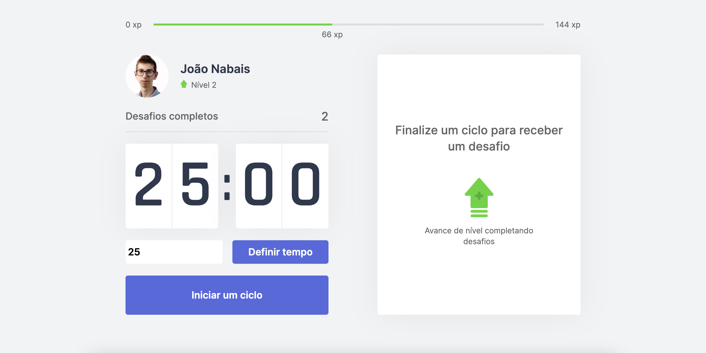

<!-- VARS -->

[star-badge]: https://img.shields.io/github/stars/joaomnabais/move-it?logo=github
[last-commit-badge]: https://img.shields.io/github/last-commit/joaomnabais/move-it
[issues-url]: https://github.com/joaomnabais/move-it/issues/
[node-url]: https://nodejs.org/en
[yarn-url]: https://classic.yarnpkg.com/
[npm-url]:  https://www.npmjs.com/
[pomodoro-url]: https://www.google.com/search?q=pomodoro+technique
[live-preview-url]:  https://moveit-joaomnabais.vercel.app/

<!-- VARS -->

<div align="center">  

![Git Stars][star-badge]
![Last Commit][last-commit-badge]

</div>

Next.js app developed based in [pomodoro][pomodoro-url] technique, at the end of each focus cycle, the user receives a challenge of an exercise.



* [Live demo][live-preview-url]

### Content
* [Getting Started](#Getting-Started-)
    * [Cloning](#Cloning)
    * [Requirements](#Requirements)
    * [Running](#Running)
* [Issues](#Issues-)
    * [Report](#Report)

### Getting Started 🚀

#### Cloning

```ps
# Create a directory in your desired location
# Clone the repository inside the directory using git
$ git clone https://github.com/joaomnabais/move-it.git
```

#### Requirements
* [Node.js][node-url]
* [Yarn][yarn-url] or [npm][npm-url]

This project use third party dependencies that need to be installed, use that command to install all needed dependencies

```ps
$ yarn install
```

>The above command will install all third party dependencies used.

To start the project run the command

```ps
$ yarn next
```

### Issues 🐛

#### Report

In case you are having any problem you can report in [Issues][issues-url] section.
